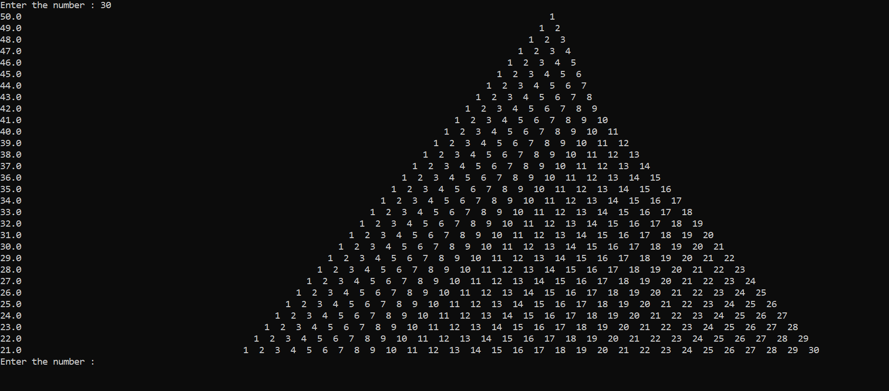

<!-- Markdown-->
P__y__~~r~~`amid`
---
<p> hard pyramid</p>
</br>

```c
#include<stdio.h>
#include<math.h>
int main()
{
    while(1)
    {
        int number,row,ro,column,space,sp=0,k,i;
        float count;
        printf("Enter the number : ");
        scanf("%d",&number);
        for(row=1; row<=number; row=row+1)
        {
            count=0;
            for(space=1; space<=number; space=space+1)
            {
                if(space<=9)
                {
                    count=count+1;
                }
                else
                {
                    count=count+2;
                }

            }
            count=count-row;
            printf("%.1f",count);
            for(i=1; i<=count; i++)

            {
                printf("  ");
            }
            for(column=1; column<=row; column=column+1)
            {
                printf("%d  ",column);
            }
            printf("\n");

        }
    }
}

```

<image src="./images/demo.png" width="500" title="not solved"/>

<!--[demo](./images/demo.png)-->

### Added the serial number 
```c
#include<stdio.h>
#include<math.h>
int main()
{
    while(1)
    {
        int number,row,ro,column,space,sp=0,k,i;
        float count;
        printf("Enter the number : ");
        scanf("%d",&number);
        for(row=1; row<=number; row=row+1)
        {
            count=0;
            for(space=1; space<=number; space=space+1)
            {
                if(space<=9)
                {
                    count=count+1;
                }
                else
                {
                    count=count+2;
                }

            }
            count=count-row;
            printf("%.1f",count);
            for(i=1; i<=count; i++)

            {
                printf(" ");
            }
            for(column=1; column<=row; column=column+1)
            {
                printf("%d ",column);
            }
            printf("\n");

        }
    }
}
```
<!---->
<image src="./images/serial.png" width="500" title="serial"/>

continue upadating my edit 
